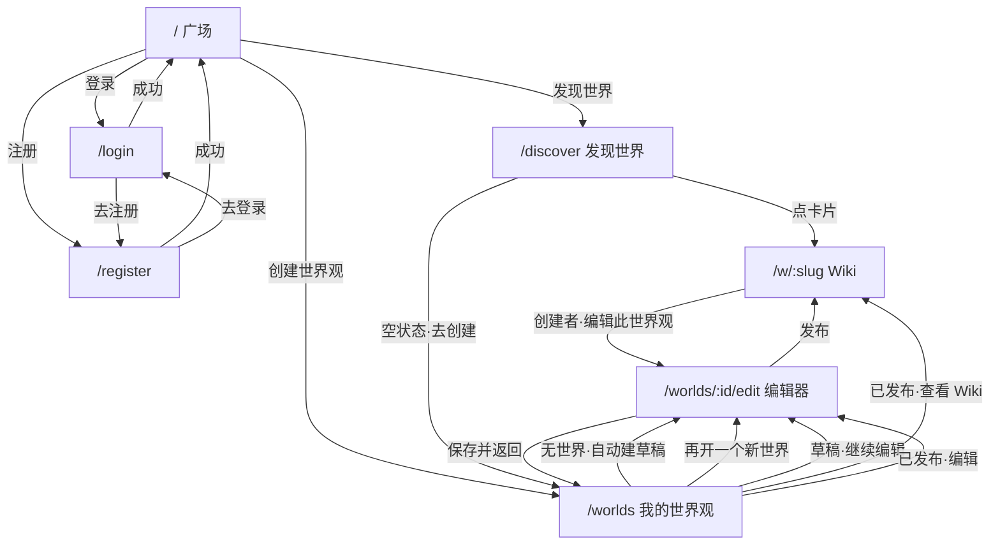

# 前端设计文档 · Web

> 版本：v0.1  
> 日期：2026-07-10  
> 状态：与当前实现同步（Next.js App Router · `frontend/`）  
> 相关：[design.md](./design.md) · [visual.md](./visual.md) · [dev-setup.md](./dev-setup.md)

---

## 1. 总览

### 1.1 技术约定

| 项 | 说明 |
|----|------|
| 框架 | Next.js（App Router）+ TypeScript + CSS Modules |
| 基址 | 前端 `http://localhost:3000`；API `NEXT_PUBLIC_API_BASE_URL`（默认 `http://localhost:4000`） |
| 鉴权 | JWT 存 `localStorage`（`if_access_token` / `if_refresh_token`）；请求头 `Authorization: Bearer …` |
| 公共壳 | [`AppShell`](../frontend/src/components/AppShell.tsx)：顶栏 + 主内容区 + 页脚；登录态在客户端挂载后再渲染，避免 hydration 不一致 |
| API 封装 | [`lib/api.ts`](../frontend/src/lib/api.ts) 的 `apiFetch`；业务封装在 [`lib/auth.ts`](../frontend/src/lib/auth.ts)、[`lib/worlds.ts`](../frontend/src/lib/worlds.ts) |

### 1.2 页面清单

| 路由 | 名称 | 登录要求 | 文件 |
|------|------|----------|------|
| `/` | 广场 | 否 | `app/page.tsx` |
| `/create` | 创作（发作品） | **是** | `app/create/page.tsx` |
| `/works/[id]` | 作品阅读 | 否 | `app/works/[id]/page.tsx` |
| `/discover` | 发现世界 | 否 | `app/discover/page.tsx` |
| `/login` | 登录 | 否（已登录可进） | `app/login/page.tsx` |
| `/register` | 注册 | 否 | `app/register/page.tsx` |
| `/worlds` | 我的世界观 | **是** | `app/worlds/page.tsx` |
| `/worlds/new` | 新建跳转 | **是** | `app/worlds/new/page.tsx` → 重定向 `/worlds` |
| `/worlds/[id]/edit` | 世界观编辑器 | **是**（仅创建者） | `app/worlds/[id]/edit/page.tsx` |
| `/w/[slug]` | Wiki 浏览 | 否（草稿仅创建者） | `app/w/[slug]/page.tsx` |

### 1.3 顶栏导航

```
[无限企划]  广场  发现世界  |  登录 / 注册                （未登录）
[无限企划]  广场  发现世界  |  创作  [创建世界观]  [头像]  （已登录）
```

- **广场** → `/`（三栏：关注世界 / 作品流 / 活跃作者）
- **发现世界** → `/discover`（公开世界观卡片）
- **创作** → `/create`（发布作品；在「创建世界观」左侧）
- **创建世界观** → `/worlds`（我的世界；无世界时自动建草稿）
- **头像** → 下拉「登出账号」（清 token，跳 `/login`）

---

## 2. 页面跳转关系



---

## 3. 各页面说明

### 3.1 广场 `/`

**定位：** 平台首页；**三栏布局**，中间作品流为主。

**界面结构：**

1. **左栏**：关注的世界观（无关注 / 未登录时显示「推荐世界观」）+「发现更多」
2. **中栏 · 最新作品**：缩略图（`mediaUrl` 或与世界观同款稳定渐变）+ 类型 / 标题 / 摘要 / 所属世界 / 作者 / 时间
3. **右栏**：活跃作者（由当前作品流去重得出）
4. **说明文案**：仅在作品流加载失败或无公开作品时显示

**功能：**

| 功能 | 状态 |
|------|------|
| 三栏布局 | ✅ |
| 最新作品流（含封面） | ✅ |
| 关注 / 推荐侧栏 | ✅（关注 API；无关注则推荐） |
| 活跃作者侧栏 | ✅（MVP 由作品流推导） |
| 空态 / 错误提示文案 | ✅ |

**调用 API：**

| 时机 | API | 鉴权 |
|------|------|------|
| 进入页 | `GET /api/works` | 否 |
| 进入页 | `GET /api/worlds?limit=8` | 否 |
| 已登录 | `GET /api/worlds/following` | Bearer |

---

### 3.2 创作 `/create`

**定位：** 登录用户发布作品到广场。

**界面：** 选所属世界观、类型、标题、摘要、可选封面 URL、正文；提交后跳作品详情。

**调用 API：** `GET /api/worlds/mine` · `POST /api/works`

---

### 3.3 发现世界 `/discover`


**定位：** 浏览**已发布且公开**的世界观；点卡片进入 Wiki。

**界面结构：**

1. Hero：标题「发现世界」+ 说明
2. 工具栏：搜索框 + 排序（最近更新 / 名称）
3. 标签筛选：全部 + 当前世界里出现过的标签 chip
4. 结果条：数量 / 当前筛选摘要 +「清除筛选」
5. 卡片网格：封面（图或稳定渐变）+ 名称 + 简介 + 标签 + 更新时间
6. 空状态：无公开世界 → 引导创建；有世界但筛空 → 清除筛选

**功能：**

| 功能 | 说明 |
|------|------|
| 搜索 | 匹配名称、简介、标签（前端过滤） |
| 标签筛选 | 可切换 / 再点取消 |
| 排序 | `updated` / `name` |
| 进入 Wiki | 卡片链接 `/w/{slug}` |

**调用 API：**

| 时机 | API | 鉴权 |
|------|-----|------|
| 进入页 | `GET /api/worlds?limit=100` | 否 |
| 进入页 | `GET /api/worlds/tag-presets` | 否 |

---

### 3.4 登录 `/login` · 注册 `/register`

**界面：** 纸本风格表单面板（标题、说明、字段、主按钮、页脚互链）。

**登录功能：**

- 字段：用户名或邮箱、密码
- 成功：写入 token → 跳 `/`
- 开发提示：`demo` / `demo12345`

**注册功能：**

- 字段：用户名、邮箱、密码、显示名（可选）
- 成功：写入 token → 跳 `/`

**调用 API：**

| 页面 | 时机 | API | Body 要点 |
|------|------|-----|-----------|
| 登录 | 提交 | `POST /api/auth/login` | `{ login, password }` |
| 注册 | 提交 | `POST /api/auth/register` | `{ username, email, password, displayName? }` |

响应均含：`user`、`accessToken`、`refreshToken`。

---

### 3.5 我的世界观 `/worlds`

**定位：** 登录用户管理自己的草稿与已发布世界。入口即顶栏「创建世界观」。

**进入逻辑：**

1. 未登录 → `/login`
2. `GET /api/worlds/mine`
3. **列表为空** → 自动 `POST /api/worlds` 建草稿 → 跳 `/worlds/{id}/edit`
4. **已有世界** → 展示列表（**不会**每次点入口都新建）

**界面结构：**

1. 标题「我的世界观」+「再开一个新世界」按钮（显式新建）
2. **草稿**区：卡片网格；操作：继续编辑、删除
3. **已发布**区：卡片网格；操作：查看 Wiki、编辑

**功能：**

| 功能 | 说明 |
|------|------|
| 自动首建 | 仅当一个世界都没有时 |
| 再开新世界 | 用户主动点按钮才 `POST` |
| 删除草稿 | 确认后软删 |
| 进编辑 / Wiki | 见跳转图 |

**调用 API：**

| 时机 | API | 鉴权 |
|------|-----|------|
| 加载 | `GET /api/worlds/mine` | 是 |
| 无世界自动建 / 再开一个 | `POST /api/worlds` | 是 |
| 删除草稿 | `DELETE /api/worlds/:id` | 是 |

---

### 3.6 世界观编辑器 `/worlds/[id]/edit`

**定位：** 创建/编辑草稿或已发布世界；边改边保存；可发布。

**权限：** 仅创建者；否则报错。未登录 → `/login`。

**界面结构（自上而下）：**

1. Logo 上传 + 名称 + 基础介绍（MD）+ 标签（预设 chip + 自定义）
2. Wiki 背景图上传
3. **人物**列表（+ 侧滑表单：名称 / 立绘 / MD）
4. **物品**列表（同上）
5. **时间轴**（竖轴展示；右侧加事件：名称 / 纪年 / MD）
6. **发布作品**：类型 / 标题 / 摘要 / 正文 → 发布到广场（MVP，仅创建者）
7. **Wiki 样式**（默认折叠）：主题 / 布局 / 头图 / 强调色 / 模块开关与顺序
8. 底栏：状态文案 ·「保存并返回」·「发布世界观」

**交互要点：**

- 名称用独立草稿态，失焦或保存/发布前会提交，避免被其它 PATCH 冲掉
- 人物/物品：点「+」主区左压，右侧滑出表单；完成收回
- 发布成功 → `/w/{slug}`

**调用 API：**

| 时机 | API |
|------|-----|
| 加载 | `GET /api/worlds/id/:id`（含 entries、timeline） |
| 标签预设 | `GET /api/worlds/tag-presets` |
| 改基础信息 / 样式 | `PATCH /api/worlds/:id`（`name`、`logoUrl`、`wikiBackgroundUrl`、`tags`、`homepageConfig`…） |
| 改介绍词条 | `PATCH /api/worlds/:id/entries/:entryId` |
| 上传图 | `POST /api/uploads`（multipart） |
| 增删改人物/物品 | `POST/PATCH/DELETE …/entries` |
| 增删时间轴 | `POST/DELETE …/timeline` |
| 发布 | `POST /api/worlds/:id/publish` |
| 发布作品 | `POST /api/works` |

---

### 3.7 作品阅读 `/works/[id]`

**定位：** 阅读中心。短篇突出标题与正文；长篇进目录，章节页有上一章 / 下一章；正文可选滚动或翻页；侧栏显示 Wiki 注释。

**界面结构：**

1. 顶栏工具：回广场 / 所属世界 · **滚动 | 翻页** · **Wiki 注释**开关（偏好记 localStorage）
2. **短篇 `story`**：大标题 + 作者 + 正文
3. **长篇 `novel`**：书名 + 摘要 + **章节目录**（点进章节阅读）
4. **章节 `chapter`**：章节名 + 所属长篇链接 + 正文 + 底栏上一章 / 目录 / 下一章
5. **Wiki 注释侧栏**：`work_entry_links` 关联词条 + 正文中匹配到的本世界词条标题；点开看摘要，链到 Wiki

**翻页模式：** 按段落打包分页；支持 ← → / PageUp PageDown。

**调用 API：** `GET /api/works/:id/read`（公开）

---

### 3.8 Wiki 浏览 `/w/[slug]`

**定位：** 某世界的公开设定主页；按 `homepageConfig` 渲染主题与模块。

**可见性：**

- `published` + `public` → 任何人可读
- 草稿 / 私密 → 仅创建者（否则 404）

**界面结构：**

1. 头图区（可关）：背景 + Logo + 世界名 + 标签；创建者显示「编辑此世界观」
2. 可选左侧目录（`layout=sidebar`）
3. 按配置顺序渲染模块：介绍 / 人物 / 物品 / 时间轴（空模块不显示）
4. 页脚更新时间

**调用 API：**

| 时机 | API | 鉴权 |
|------|-----|------|
| 加载 | `GET /api/worlds/:slug` | 可选（有 token 时带上，用于识别 `isOwner`） |

响应：`{ world, entries, timeline, isOwner }`。

---

## 4. 后端 API 对照（前端会用到的）

### 4.1 认证

| 方法 | 路径 | 前端封装 | 说明 |
|------|------|----------|------|
| POST | `/api/auth/register` | `register()` | 注册并返回 token |
| POST | `/api/auth/login` | `login()` | 登录并返回 token |
| GET | `/api/auth/me` | `fetchMe()` | 当前用户 |

### 4.2 世界

| 方法 | 路径 | 前端封装 | 说明 |
|------|------|----------|------|
| GET | `/api/worlds` | `fetchPublicWorlds()` | 公开已发布列表（发现世界） |
| GET | `/api/worlds/tag-presets` | `fetchTagPresets()` | 系统标签 |
| GET | `/api/worlds/mine` | `fetchMyWorlds()` | 我的（含草稿） |
| GET | `/api/worlds/following` | `fetchFollowedWorlds()` | 关注列表（广场左栏） |
| POST | `/api/worlds` | `createWorld()` | 建草稿 |
| GET | `/api/worlds/id/:id` | `fetchWorldById()` | 按 id 详情（编辑器用） |
| GET | `/api/worlds/:slug` | `fetchWorldBySlug()` | 按 slug（Wiki） |
| PATCH | `/api/worlds/:id` | `updateWorld()` | 更新元数据 / 样式 |
| POST | `/api/worlds/:id/publish` | `publishWorld()` | 发布 |
| DELETE | `/api/worlds/:id` | `deleteWorld()` | 软删 |

### 4.3 作品

| 方法 | 路径 | 前端封装 | 说明 |
|------|------|----------|------|
| GET | `/api/works` | `fetchPublicWorks()` | 广场公开作品流 |
| GET | `/api/works/:id` | `fetchWorkById()` | 作品详情 |
| POST | `/api/works` | `createWork()` | 创建者发布（MVP） |

### 4.4 词条 · 时间轴 · 上传

| 方法 | 路径 | 前端封装 |
|------|------|----------|
| GET/POST | `/api/worlds/:id/entries` | `fetchEntries` / `createEntry` |
| PATCH/DELETE | `/api/worlds/:id/entries/:entryId` | `updateEntry` / `deleteEntry` |
| GET/POST | `/api/worlds/:id/timeline` | `fetchTimeline` / `createTimelineEvent` |
| PATCH/DELETE | `/api/worlds/:id/timeline/:eventId` | `updateTimelineEvent` / `deleteTimelineEvent` |
| POST | `/api/uploads` | `uploadImage()` |

静态文件：上传后 URL 形如 `http://localhost:4000/files/...`，由后端 `/files/*` 提供。

### 4.5 鉴权约定

- 写操作与「我的」列表：**必须** Bearer；用户 id 只信 JWT，不信客户端传的 `userId`
- 公开读：`GET /api/worlds`、`GET /api/worlds/:slug`（公开世界）、`GET /api/worlds/tag-presets`、`GET /api/works`、`GET /api/works/:id` 可不带 token
- `401`：前端 `apiFetch` 会清 token

---

## 5. 关键组件（跨页复用）

| 组件 | 用途 |
|------|------|
| `AppShell` | 全局壳与顶栏 |
| `WorldCard` | 世界卡片（发现 / 我的）；无图用稳定渐变封面 |
| `MarkdownView` | MD 渲染（介绍、词条、时间轴、Wiki） |
| `ImageUpload` | 选图 → `POST /api/uploads` |
| `EntrySlidePanel` | 人物/物品侧滑编辑 |
| `TimelineEditor` | 时间轴列表 + 右侧加事件 |
| `StylePanel` | Wiki 样式（折叠面板） |

---

## 6. 尚未实现（与产品文档对照）

| 能力 | 说明 |
|------|------|
| 广场作品流 | ✅ 已实现 |
| 作品阅读 | ✅ 滚动/翻页 · 章节导航 · Wiki 注释 |
| 世界入口页 | 欢迎词 + 该世界作品流（设计文档有，前端未做） |
| 关注列表侧栏 | ✅ 广场三栏已做（关注 API；无关注则推荐） |
| Fork / 权限配置 UI | 后端表有部分字段，前端未做 |
| 词条详情页 | Wiki 目前列表级展示，无独立 `/w/:slug/:entry` |

---

## 7. 修订记录

| 版本 | 日期 | 说明 |
|------|------|------|
| v0.1 | 2026-07-10 | 首版：页面、跳转、API 与当前实现对齐 |
| v0.2 | 2026-07-10 | 广场作品流：空态才显示说明文案；作品 API / 详情 / 编辑器发布 |
| v0.3 | 2026-07-10 | 顶栏「创作」；广场三栏；作品封面图/默认渐变 |
| v0.4 | 2026-07-10 | 阅读界面：滚动/翻页、长篇上下章、Wiki 注释 |
